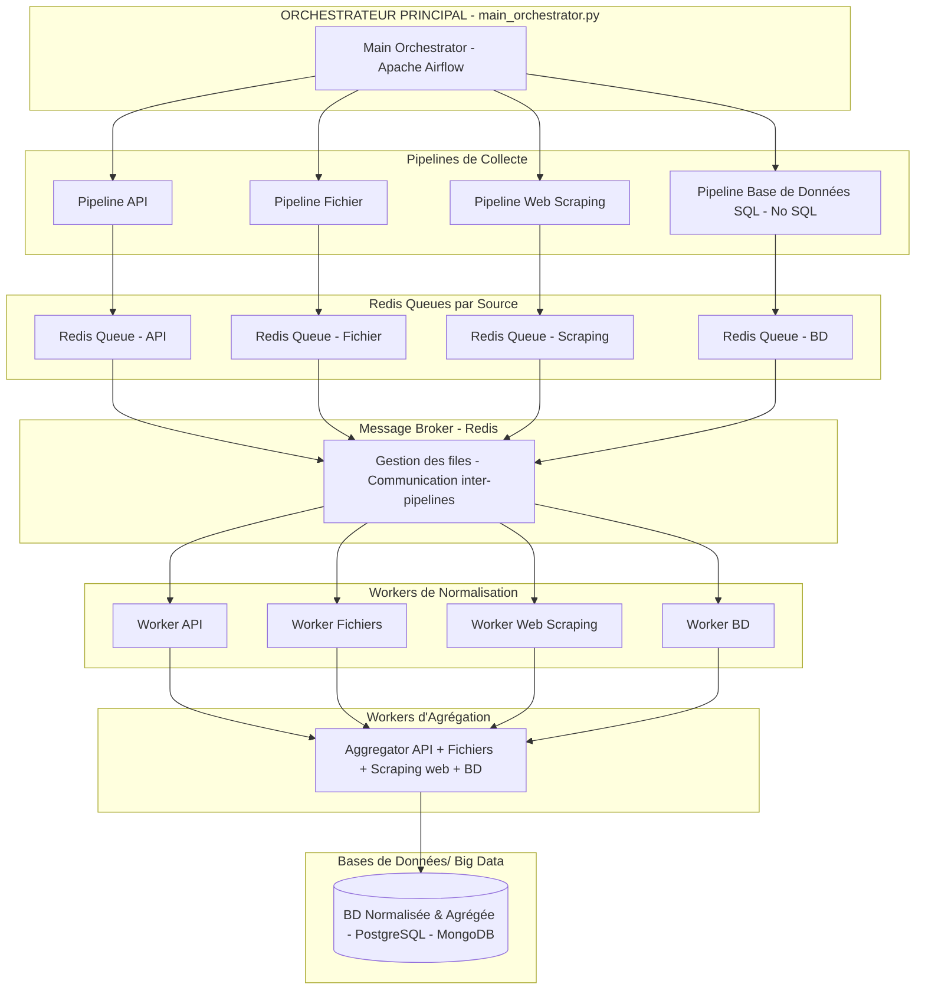
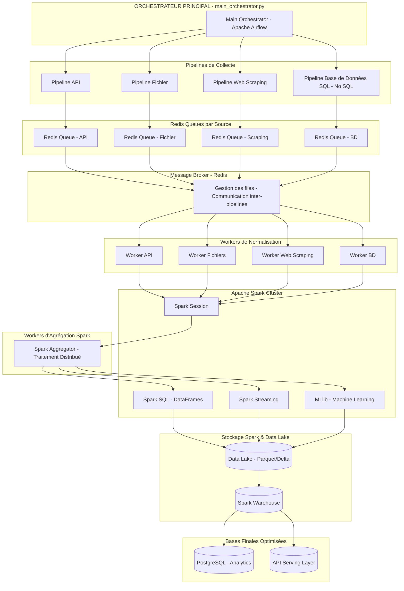
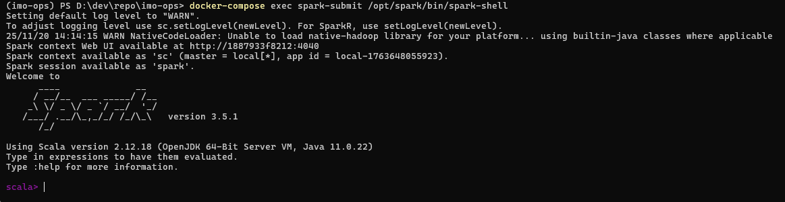
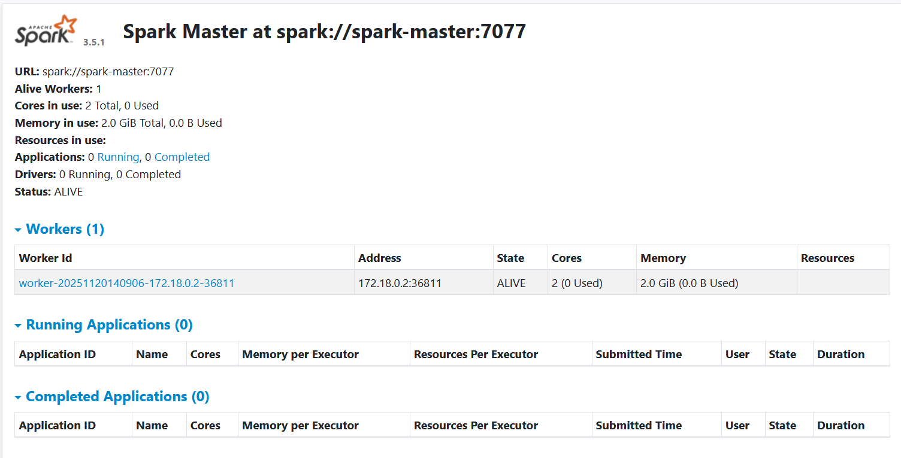
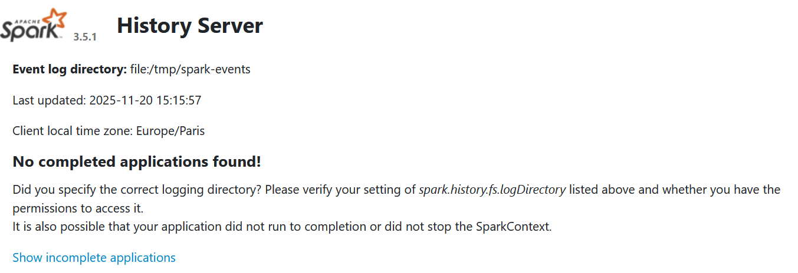

# IMO-Ops: Data Plateform IMO-Ops pour un projet en intelligence artificielle dédié au marché Immobilier


## Contexte & objectifs:
- Une application IA, par exemple un chatbot LLM RAG a besoin d'accès à des données en temps réel auprès de différentes sources du marché immobilier. L’objectif est donc de produire une Data Plateform dédié au marché immobilier


L’architecture ( écosystème/stack technologique)
- Orchestration de pipelines avec messaging, parallélisation & mise à l’échelle (Apache Airflow+Redis - Dags - Logs)
- Scraping: Playwright avec fichiers de configuration
- Manipulation et transformation des données: Pandas, Regex, SQLAlchemy, Requests
- Bases de données: Sql (PostgreSQL-pgadmin) & NoSQL (MongoDB)
- API: FastAPI
- Rapports & consultation des données (Prometheus- Grafana, Plotly-Dashboards, Gradio)
- Conteneurisation: Docker

Les processus:
- batchs/pipelines de collecte à partir de différentes sources: scraping web, fast API, fichiers csv, bases de données
postgres, fichiers csv
- batchs/pipelines de normalisation après l’extraction des données
- batch/pipeline d’agrégation des données en provenance des différentes sources
- batch/pipelines de stockage en base de données SQL & NoSQL
- batch/pipeline d’interrogation des données
- batch/pipeline de mise à disposition des données

Les sources de données:
site web: IAD-Immobilier (https://www.iadfrance.fr/): annonces achats, ventes, location sur critères multiples: 

# Architecture
## Architecture Airflow-Redis-Postgres-Mongodb pour MLOps



## Architecture Airflow-Redis-Spark-Postgres pour MLOps



# Prerequisite

  - uv (https://docs.astral.sh/uv/guides/install-python/)
  - Apache Airflow (https://airflow.apache.org/)   
  - Postgres SQL (https://www.postgresql.org/download/windows/)
  - Mongodb (https://www.mongodb.com/docs/manual/installation/)
  - Redis (https://redis.io/)
  - Plawright (https://playwright.dev/)

# Installation
-  Clone the repo and access to files
```bash
git clone https://github.com/OlivierLAVAUD/imo-ops.git

cd imo-ops
```

## install with docker

- Launch Docker-Desktop before
- ..., then launch docker services
```bash
# for all services
docker-compose up -d

# for Airflow profile services
docker-compose --profile airflow up -d

# for noSQL Database: MongoDB profile services
docker-compose --profile mongodb up -d

# for Gradio app with gradio profile services
docker-compose --profile gradio up -d

# for Spark
docker-compose --profile spark up -d
```
- check
```bash
# Vérifier que tout fonctionne
docker-compose ps
```
Then acess to the applications from Docker Desktop with https://localhost:<ports>


- Spark 
```bash
# Tester un job
docker-compose exec spark-submit /opt/scripts/submit-job.sh /opt/scripts/wordcount.py

# Ou tester spark-shell interactif
docker-compose exec spark-submit /opt/spark/bin/spark-shell

# Redémarrer complètement
docker-compose --profile spark down -v --rmi all
docker-compose --profile spark up -d

```
🌐 URLs d'accès :

    - Spark Master UI : http://localhost:8085 
    - Spark History Server : http://localhost:18080
    - Airflow : http://localhost:8080






## Compétences
###  Compétence C1: Automatisation de l'extraction de données (c1_scrap Service:)

```bash
cd c1_scrap
# see the README.md file
```
### Compétences C2: Développement de requêtes SQL(c2_sql Service)
```bash
cd c2_sql
# see the README.md file
```
### Compétences C3:  Agrégation et préparation des données (c3_aggr Service)
```bash
cd c3_aggr
# see the README.md file
```
### Compétence C4 : Création de Base de Données (c4_create_db Service)
```bash
cd c4_create_db
# see the README.md file
```

### Compétence C5: Développement d’une API Rest (c5_api  Service)
```bash
cd c5_api
# see the README.md file
```


# Notes
## Docker

Install with docker

```bash
docker-compose --profile airflow up -d
```

Cleaning Docker
```bash

docker-compose --profile airflow down -v --rmi all

# Arrête et supprime les conteneurs, réseaux, volumes, images buildées du projet courant
docker-compose down -v --rmi all

# Supprime le cache du build
docker builder prune
docker system prune -f

```

