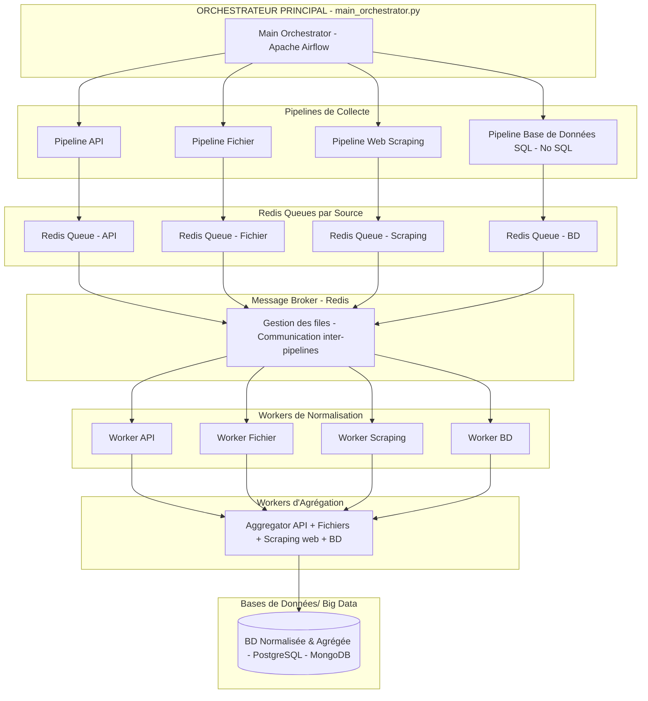

# IMO-Ops: Data Plateform IMO-Ops pour un projet en intelligence artificielle dédié au marché Immobilier


## Contexte & objectifs:
- Une application IA, par exemple un chatbot LLM RAG a besoin d'accès à des données en temps réel auprès de différentes sources du marché immobilier. L’objectif est donc de produire une Data Plateform dédié au marché immobilier


L’architecture ( écosystème/stack technologique)
- Orchestration de pipelines avec messaging, parallélisation & mise à l’échelle (Apache Airflow+Redis - Dags - Logs)
- Scraping: Playwright avec fichiers de configuration
- Manipulation et transformation des données: Pandas, Regex, SQLAlchemy, Requests
- Bases de données: Sql (PostgreSQL-pgadmin) & NoSQL (MongoDB)
- API: FastAPI
- Rapports & consultation des données (Prometheus- Grafana, Plotly-Dashboards, Gradio)
- Conteneurisation: Docker

Les processus:
- batchs/pipelines de collecte à partir de différentes sources: scraping web, fast API, fichiers csv, bases de données
postgres, fichiers csv
- batchs/pipelines de normalisation après l’extraction des données
- batch/pipeline d’agrégation des données en provenance des différentes sources
- batch/pipelines de stockage en base de données SQL & NoSQL
- batch/pipeline d’interrogation des données
- batch/pipeline de mise à disposition des données

Les sources de données:
site web: IAD-Immobilier (https://www.iadfrance.fr/): annonces achats, ventes, location sur critères multiples: 


## Architecture





# Prerequisite

    - uv: 
    - services/c1_scrap/config.json: fichier référencant les proprietes d'acessibilité du site web, désirant être collectées, ainsi que d'autres paramètres

  - Postgres SQL (https://www.postgresql.org/download/windows/)


# Installation & Usage 

## with Docker Airflow services
```bash
# clone the repo
git clone https://github.com/OlivierLAVAUD/imo-ops.git
cd imo-ops

# Launch Docker-Desktop before and run all the services
docker-compose up -d

 # Acess to the applications from Docker Desktop with https://localhost:<ports>
```

## with Docker or sources
###  Compétence C1: Automatisation de l'extraction de données (c1_scrap Service:)

```bash
cd c1_scrap
# see the README.md file
```
### Compétences C2: Développement de requêtes SQL(c2_sql Service)
```bash
cd c2_sql
# see the README.md file
```
### Compétences C3:  Agrégation et préparation des données (c3_aggr Service)
```bash
cd c3_aggr
# see the README.md file
```
### Compétence C4 : Création de Base de Données (c4_create_db Service)
```bash
cd c4_create_db
# see the README.md file
```

### Compétence C5: Développement d’une API Rest (c5_api  Service)
```bash
cd c5_api
# see the README.md file
```


# Notes
## Docker
Cleaning Docker
```bash
docker-compose down -v
docker ps -aq | ForEach-Object { docker stop $_ }
# Supprimer tous les conteneurs (arrêtés et en cours)
docker ps -aq | ForEach-Object { docker rm -f $_ }
# Supprimer toutes les images
docker rmi -f $(docker images -aq)
# Supprimer tous les volumes
docker volume rm -f $(docker volume ls -q)
# Supprimer tous les réseaux personnalisés
docker network rm $(docker network ls -q --filter type=custom)
# Nettoyer tout le cache de build
docker builder prune -a -f
# Supprimer les caches orphelins
docker system prune -a -f --volumes

```

