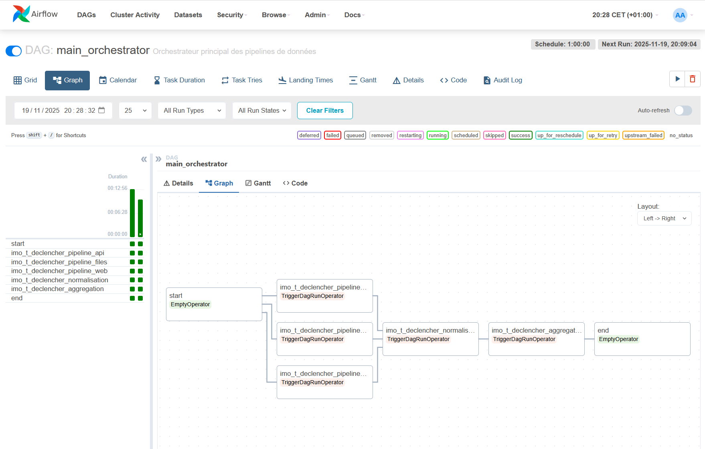
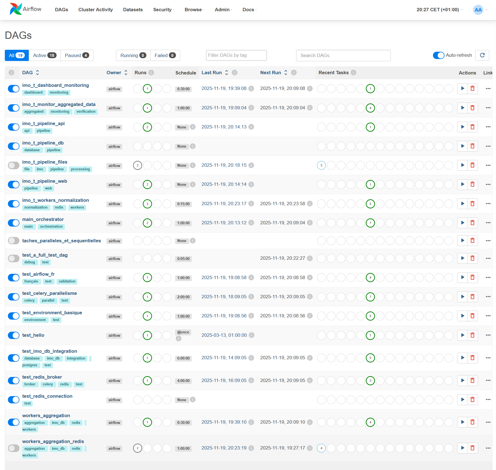
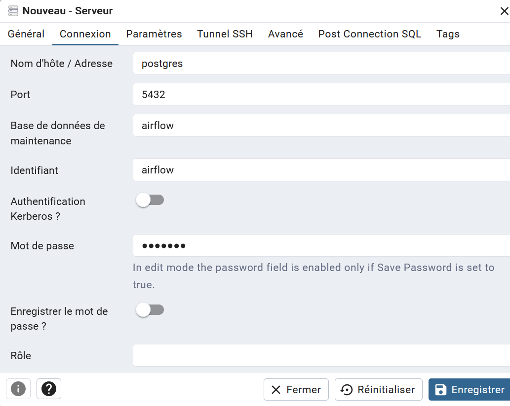
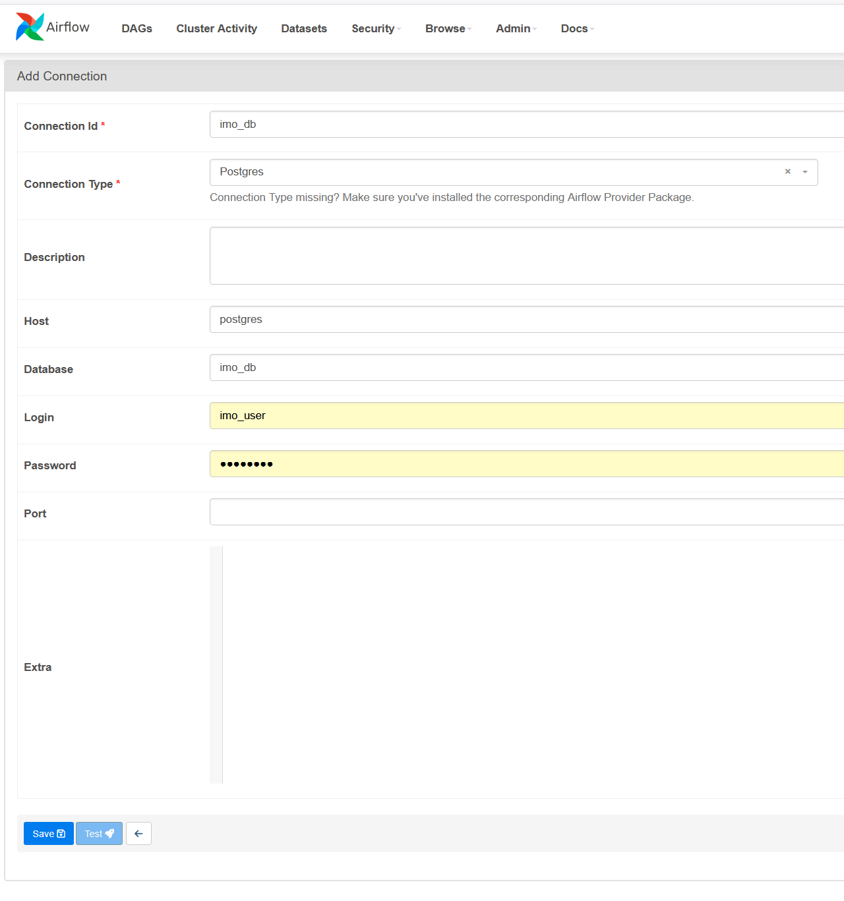
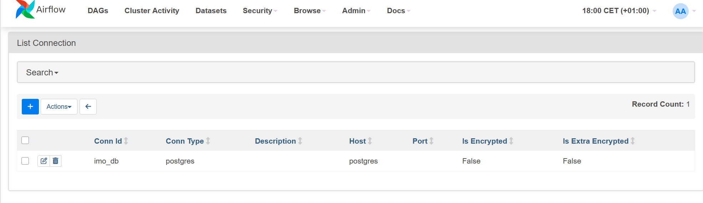
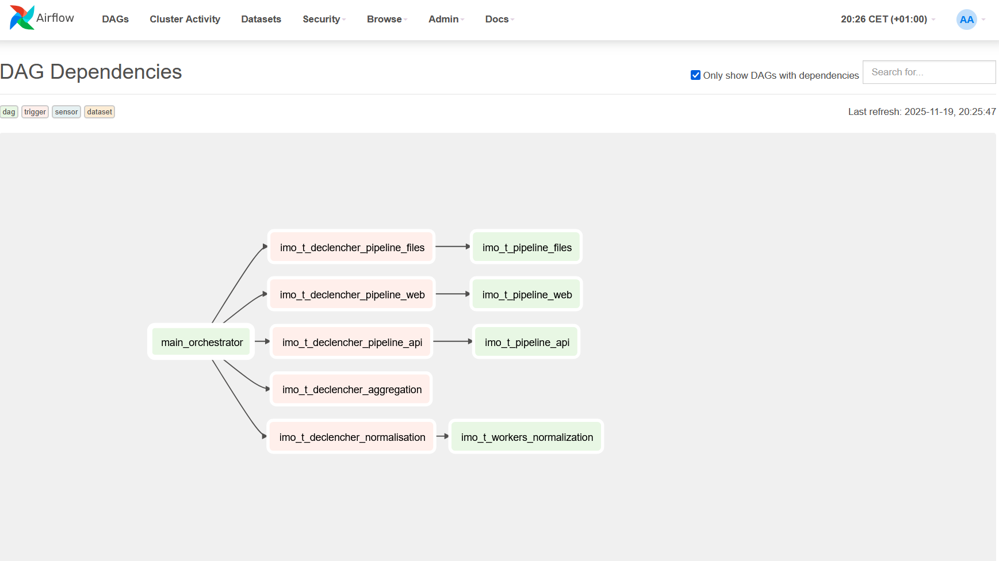
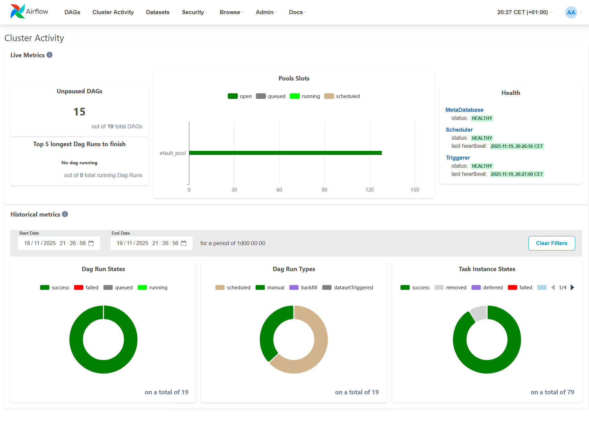

# Airflow




# Installation 

```bash

# Demarrer les serviecs
docker-compose up -d

# Vérifier l'état des services
docker-compose ps

# Démarrage des services
docker-compose up -d

# Surveillance des logs en temps réel
docker-compose logs -f postgres

# Dans un autre terminal, surveiller Airflow
docker-compose logs -f airflow-init

# Arrêt et nettoyage des anciens conteneurs
docker-compose down -v
```

# Vérification
```bash
# Vérifier que toutes les bases sont créées
docker-compose exec postgres psql -U airflow -c "\l"

# Vérifier les tables imo_db
docker-compose exec postgres psql -U imo_user -d imo_db -c "\dt"

# Vérifier Airflow
docker-compose exec airflow-worker airflow db check
docker-compose exec airflow-worker airflow users list

# Tester la connexion avec votre script
docker-compose exec airflow-worker python /opt/airflow/test_postgres.py

```

# Configuration

## Configuration .env
Vous pouvez ajuster les parametres en éditant le fichier .env


## Configuration Pgadmin

localhost:5050


- en reference le contenu de .venv
```bash
# PostgreSQL
POSTGRES_USER=airflow
POSTGRES_PASSWORD=airflow
POSTGRES_DB=airflow
POSTGRES_MULTIPLE_DATABASES=imo_db,airflow_db
POSTGRES_PORT=5432
```

## Configuration Airflow


accedez avec le user admin/admin

Ajoutez la base imo_db

Dans le menu Admin/connexion

    Cliquez sur le "+" pour ajouter une nouvelle connexion
    Remplissez les champs :


```bash
Connection ID: imo_db
Connection Type: Postgres
Host: postgres
Schema: imo_db  
Login: imo_user
Password: password
Port: 5432
```




# pour redis:
```bash
airflow connections add 'redis_default' \
    --conn-type 'redis' \
    --conn-host 'redis' \          # ou l'IP de votre serveur Redis
    --conn-port '6379' \           # port par défaut Redis
    --conn-password '' \           # mot de passe si configuré
    --conn-extra '{
        "db": 0,
        "socket_connect_timeout": 5,
        "socket_keepalive": true,
        "retry_on_timeout": true,
        "encoding": "utf-8"
    }'
```
# Tests:
```bash
Write-Host "=== Test des imports ESSENTIELS ===" -ForegroundColor Green

Write-Host "`n1. PostgresOperator (le plus important) :" -ForegroundColor Yellow
docker-compose exec --user airflow airflow-webserver python -c "from airflow.providers.postgres.operators.postgres import PostgresOperator; print('✅ PostgresOperator OK')"

Write-Host "`n2. PostgresHook :" -ForegroundColor Yellow
docker-compose exec --user airflow airflow-webserver python -c "from airflow.providers.postgres.hooks.postgres import PostgresHook; print('✅ PostgresHook OK')"

Write-Host "`n3. RedisHook :" -ForegroundColor Yellow
docker-compose exec --user airflow airflow-webserver python -c "from airflow.providers.redis.hooks.redis import RedisHook; print('✅ RedisHook OK')"

Write-Host "`n4. Import complet pour votre DAG :" -ForegroundColor Yellow
docker-compose exec --user airflow airflow-webserver python -c "
from airflow import DAG
from airflow.operators.python import PythonOperator
from airflow.operators.bash import BashOperator
from airflow.providers.postgres.operators.postgres import PostgresOperator
from datetime import datetime, timedelta
print('✅ Tous les imports pour votre DAG fonctionnent parfaitement!')
"


```

# Annexes:






