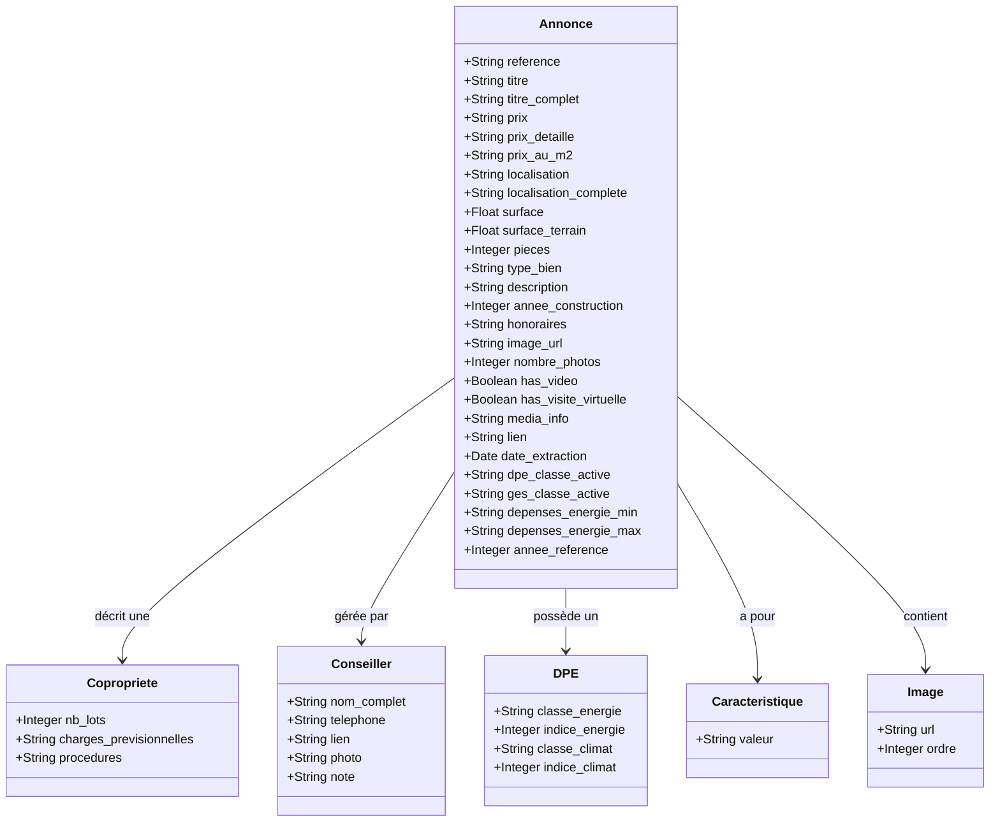

# c4_create_db

## Modele de donnée IMO





# Installation

```bash
# Creation de la base de données imo_db
psql -U postgres -f sql\create_imo_db_init.sql
# Acces a imo_db et reation de la structure et des données partielles.
psql -U postgres -d imo_db -f sql\create_imo_db.sql

# Acces a la base pour verification
psql -U postgres -d imo_db
```

# Usage 

```bash
# Cleaning de la base imo_db
uv run clean_imo_db.py
# Import des données dans la base imo_db a partir du fichier json
uv run import_annonces.py

```

# Exemples de requetes
```bash
select id_annonce, reference from annonces group by annonces.id_annonce,reference order by reference ;
select * from annonces where annonces.id_annonce=1 ;
select * from annonces where reference = '1885312';

SELECT 
    a.*,
    c.nom_complet as conseiller_nom_complet,
    c.telephone as conseiller_telephone,
    c.lien as conseiller_lien,
    c.photo as conseiller_photo,
    c.note as conseiller_note,
    d.classe_energie as dpe_classe_energie,
    d.indice_energie as dpe_indice_energie,
    d.classe_climat as dpe_classe_climat,
    d.indice_climat as dpe_indice_climat,
    cp.nb_lots as copropriete_nb_lots,
    cp.charges_previsionnelles as copropriete_charges,
    cp.procedures as copropriete_procedures,
    car.valeur as caracteristiques,
    img.url as images_url,
    img.ordre as images_ordre
FROM annonces a
LEFT JOIN conseiller c ON a.id_annonce = c.id_annonce
LEFT JOIN dpe d ON a.id_annonce = d.id_annonce
LEFT JOIN copropriete cp ON a.id_annonce = cp.id_annonce
LEFT JOIN caracteristiques car ON a.id_annonce = car.id_annonce
LEFT JOIN images img ON a.id_annonce = img.id_annonce
WHERE a.reference = '1885312';


```

