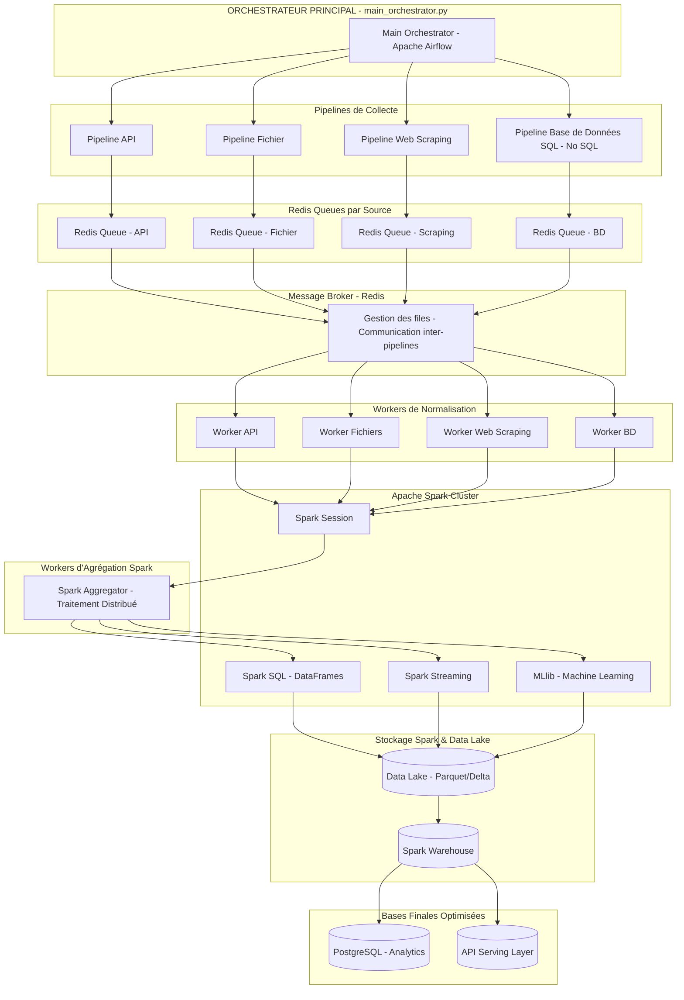
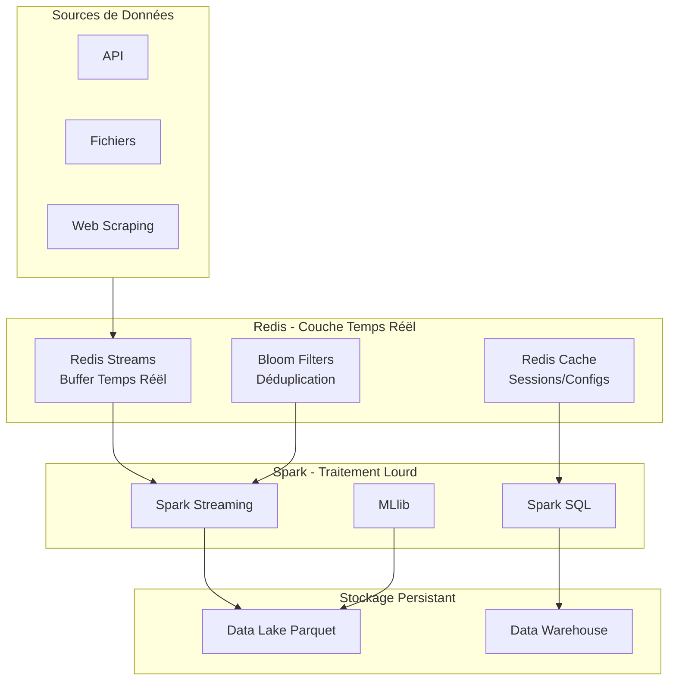
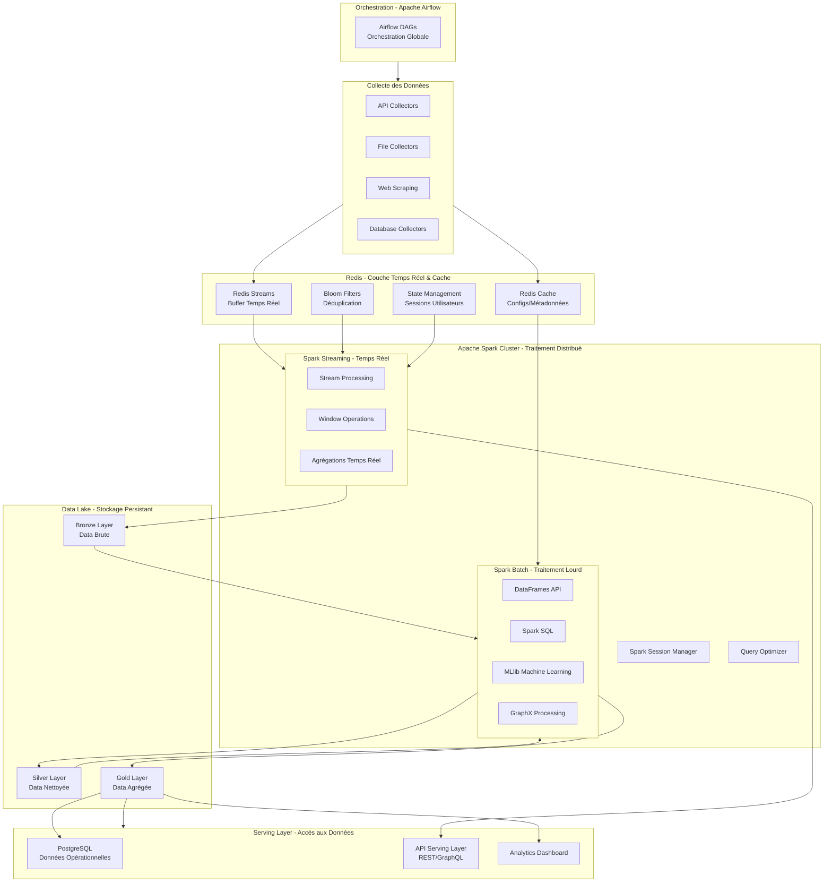
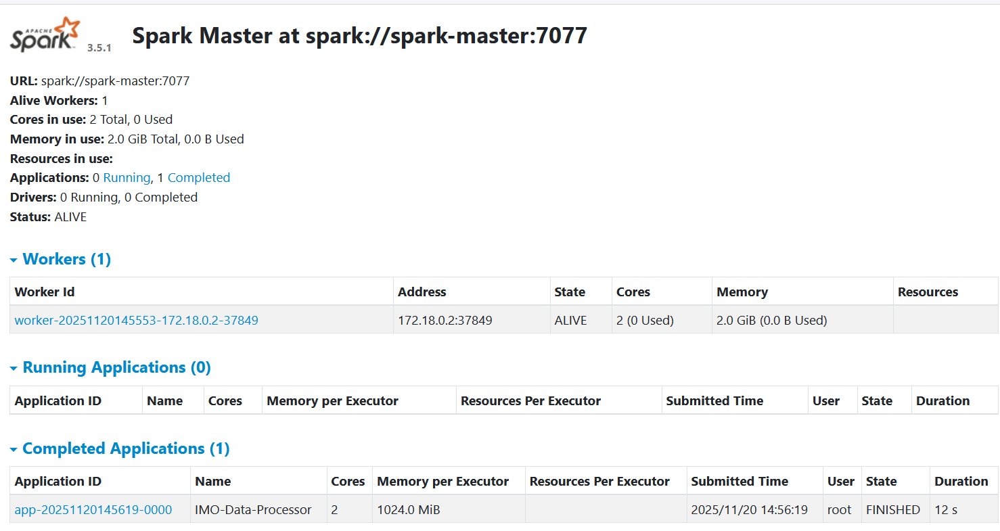
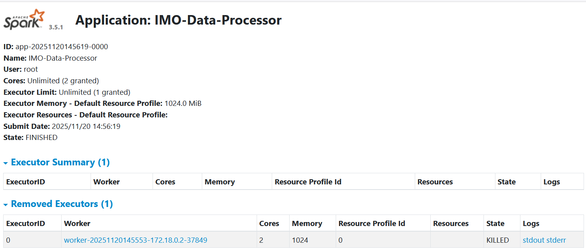

# 

# Architecture Cible

## Architecture optimiséee avec Redis+Spark

- Sources → Redis (buffer/cache) → Spark (traitement) → Data Lake




```text
Redis
    ✅ Buffer temps réel entre collecte et Spark
    ✅ Cache des métadonnées et configurations
    ✅ Déduplication en temps réel
    ✅ Gestion des sessions utilisateur

Spark

    ✅ Stockage temporaire des gros volumes
    ✅ Agrégations et transformations complexes
    ✅ Machine Learning et analytics
    ✅ Data Lake et entrepôt de donnée

```
## Architecture Opitmisee pour imo-ops



# Utilisation
```bash
# Démarrer Spark
docker-compose --profile spark up -d

# Supprimer Spark
docker-compose --profile spark down -v --rmi all
```


# Vérifier que tout fonctionne
 Ouvrir http://localhost:8080

```bash
# Tester un job
docker-compose exec spark-submit /opt/scripts/submit-job.sh /opt/scripts/wordcount.py

```


# Utilisation
```bash
# Préalable
# si necesseaire
docker-compose exec spark-submit pip install python-dotenv

# Exécuter le script spark_importer.py
docker-compose exec spark-submit /opt/scripts/submit-job.sh /opt/scripts/spark_importer.py


# Note: pour copier le script et les données dans le conteneur Spark (pas necessaire car présent dans scripts)
docker cp spark_importer.py imo-ops-spark-submit-1:/opt/scripts/
docker cp annonces_agregees.json imo-ops-spark-submit-1:/opt/data/
docker cp config_aggreges.json imo-ops-spark-submit-1:/opt/scripts/


```


