```mermaid
flowchart TB
    %% === ORCHESTRATION ===
    subgraph Orchestration["Orchestration - Apache Airflow"]
        Airflow[Airflow DAGs<br/>Orchestration Globale]
    end

    %% === COLLECTE ===
    subgraph DataCollection["Collecte des Données"]
        API[API Collectors]
        Files[File Collectors]
        Web[Web Scraping]
        DB[Database Collectors]
    end

    %% === REDIS OPTIMISÉ ===
    subgraph RedisLayer["Redis - Couche Temps Réel & Cache"]
        Streams[Redis Streams<br/>Buffer Temps Réel]
        Cache[Redis Cache<br/>Configs/Métadonnées]
        Dedup[Bloom Filters<br/>Déduplication]
        State[State Management<br/>Sessions Utilisateurs]
    end

    %% === SPARK CORE ===
    subgraph SparkCore["Apache Spark Cluster - Traitement Distribué"]
        SparkSession[Spark Session Manager]
        
        subgraph SparkStreaming["Spark Streaming - Temps Réel"]
            StreamProc[Stream Processing]
            WindowOps[Window Operations]
            RealTimeAgg[Agrégations Temps Réel]
        end
        
        subgraph SparkBatch["Spark Batch - Traitement Lourd"]
            DataFrames[DataFrames API]
            SparkSQL[Spark SQL]
            MLlib[MLlib Machine Learning]
            GraphX[GraphX Processing]
        end
        
        SparkOptimizer[Query Optimizer]
    end

    %% === DATA LAKE ===
    subgraph DataLake["Data Lake - Stockage Persistant"]
        Bronze[Bronze Layer<br/>Data Brute]
        Silver[Silver Layer<br/>Data Nettoyée]
        Gold[Gold Layer<br/>Data Agrégée]
    end

    %% === SERVING LAYER ===
    subgraph ServingLayer["Serving Layer - Accès aux Données"]
        PostgreSQL[PostgreSQL<br/>Données Opérationnelles]
        APIServe[API Serving Layer<br/>REST/GraphQL]
        Analytics[Analytics Dashboard]
    end

    %% === CONNECTIONS ===
    Orchestration --> DataCollection
    
    DataCollection --> Streams
    DataCollection --> Cache
    
    Streams --> SparkStreaming
    Cache --> SparkBatch
    Dedup --> SparkStreaming
    State --> SparkStreaming
    
    SparkStreaming --> Bronze
    SparkBatch --> Silver
    SparkBatch --> Gold
    
    Bronze --> SparkBatch
    Silver --> SparkBatch
    Gold --> ServingLayer
    
    SparkStreaming --> APIServe
    Gold --> PostgreSQL
    Gold --> Analytics
```

# 

# Architecture Cible

## Architecture optimiséee avec Redis+Spark

- Sources → Redis (buffer/cache) → Spark (traitement) → Data Lake

```mermaid
flowchart TB
    subgraph DataSources[Sources de Données]
        API[API]
        Files[Fichiers]
        Web[Web Scraping]
    end

    subgraph RedisLayer[Redis - Couche Temps Réël]
        Streams[Redis Streams<br/>Buffer Temps Réël]
        Cache[Redis Cache<br/>Sessions/Configs]
        Dedup[Bloom Filters<br/>Déduplication]
    end

    subgraph SparkCore[Spark - Traitement Lourd]
        SparkStream[Spark Streaming]
        SparkSQL[Spark SQL]
        SparkML[MLlib]
    end

    subgraph Storage[Stockage Persistant]
        DataLake[Data Lake Parquet]
        Warehouse[Data Warehouse]
    end

    DataSources --> Streams
    Streams --> SparkStream
    Cache --> SparkSQL
    Dedup --> SparkStream
    
    SparkStream --> DataLake
    SparkSQL --> Warehouse
    SparkML --> DataLake

```




```text
Redis
    ✅ Buffer temps réel entre collecte et Spark
    ✅ Cache des métadonnées et configurations
    ✅ Déduplication en temps réel
    ✅ Gestion des sessions utilisateur

Spark

    ✅ Stockage temporaire des gros volumes
    ✅ Agrégations et transformations complexes
    ✅ Machine Learning et analytics
    ✅ Data Lake et entrepôt de donnée

```
## Architecture Optimisee pour imo-ops
```text
📊 Flux de Données Optimisé

    - Collecte → Données vers Redis Streams + Cache metadata
    - Streaming → Spark lit Redis Streams, traite et écrit dans Bronze
    - Batch → Spark nettoie Bronze → Silver → Gold
    - Serving → Données agrégées vers PostgreSQL + API

🎯 Avantages de cette Architecture

    ✅ Faible latence avec Redis pour le temps réel
    ✅ Scalabilité horizontale avec Spark
    ✅ Data Lake pour l'historique complet
    ✅ Déduplication efficace avec Bloom Filters
    ✅ Monitoring via Airflow
    ✅ Séparation des concerns claire
```



# Utilisation
```bash
# Démarrer Spark
docker-compose --profile spark up -d

# Supprimer Spark
docker-compose --profile spark down -v --rmi all
```


# Vérifier que tout fonctionne
 Ouvrir http://localhost:8080

```bash
# Tester un job
docker-compose exec spark-submit /opt/scripts/submit-job.sh /opt/scripts/wordcount.py

```


# Utilisation
```bash
# Préalable
# si necesseaire
docker-compose exec spark-submit pip install python-dotenv

# Exécuter le script spark_importer.py
docker-compose exec spark-submit /opt/scripts/submit-job.sh /opt/scripts/spark_importer.py


# Note: pour copier le script et les données dans le conteneur Spark (pas necessaire car présent dans scripts)
docker cp spark_importer.py imo-ops-spark-submit-1:/opt/scripts/
docker cp annonces_agregees.json imo-ops-spark-submit-1:/opt/data/
docker cp config_aggreges.json imo-ops-spark-submit-1:/opt/scripts/


```


